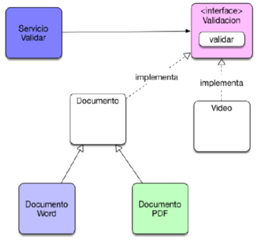
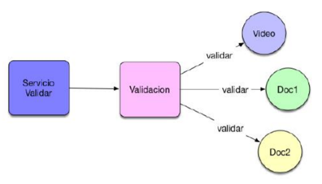

# Polimorfismo por interfaces
Este código de ejemplo busca explicar como se implementa el polimorfismo por medio del uso de interfaces, en Java.

La clase de Servicio, recibe un objeto que implemente la Interfáz Validacion

Finalmente, obtenemos una estructura similar a la siguiente:

